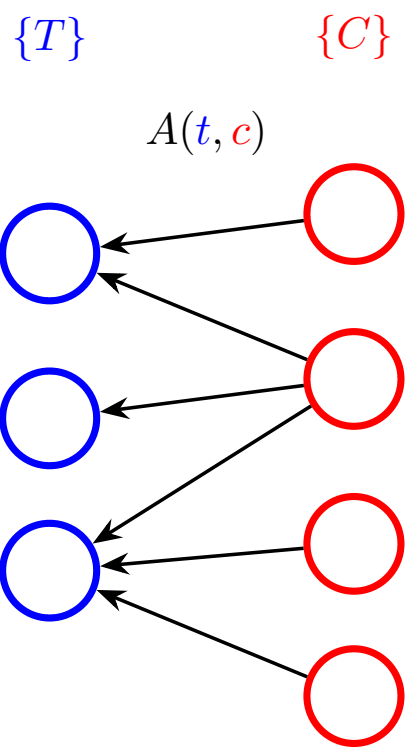

[SI AUGUSTUS CERNATUR, CERNANTUR QOUQUE AMICI]{style="float:right"}

##

`r format(Sys.Date(), "%d %b %Y")` 

`r library(knitr)`
`r library(markdown)`
`r library(best.friends)`
`r options(width=80,keep.source=TRUE)`
`r opts_chunk$set(echo=TRUE,message=FALSE,cache=FALSE,warning=FALSE)`
<!-- cache is off, we save all the necessary things in Rda -->

<div style="line-height: 1.5em;">

## Introduction

There is a simple intuition of what it means to be a friend. A friend of Augustus cares about Augustus more than about other people. And, if we see Augustus, then we infer to see friends(s) of Augustus also. Let’s translate it into statistical language.

Consider a set of genes and their loads in a set of expression patterns. Each pattern represents a biological process by the expression levels of the involved genes. 

Sometimes, the expression of a single gene indicates the activity of the entire pattern. In the simplest case, the gene has a nonzero load in only one pattern. 
Moreover, the gene may have several nonzero loads, but all of them but one are relatively small. Then the gene (AKA Augustus) is the marker gene for the pattern, and the marked pattern is the best friend of this gene. We want to identify the marker genes and corresponding patterns statistically.  

\paragraph{Model} The bipartite graph naturally fits this model. To generalise the example, we will refer to genes as \textit{{\tag}s}, and to expression patterns, as \textit{{\collection}s}, and to any load as \textit{attention}. The sketch below illustrates the setting.

{width=25%}

To be more specific, we are given a set of collections $C = \{c_1, \dots, c_k\}$, and a set of tags $T = \{t_1, \dots, t_n\}$.
Each tag $t \in T$ and collection $c \in C$ are related by the attention $A(t, c)$, that the cloud pays to the tag. The strength of attention varies from $0$ to infinity, $A(t, c)\ge 0$. 

In the following, the attention values are stored in $n\times k$ matrix $\mathcal{A}$. 

The tag-collection-attention model applies to many problems in bioinformatics and statistics.

        Example                           tag $t$         collection $c$                           attention $A\left(t,c\right)$
--------------------------------------   -------------   ----------------------------------  ----------------------------
[gene regulation by TFs](#toyTF)          gene            genes under the TF regulation       strength of regulation
[transctironal correlations](#toynet)     gene            genes coexpressed with a gene       transcription correlation
fuzzy clustering                          object          cluster                             object weight in cluster
transcription decomposition               transcript      transcription pattern               transcript's load in pattern
weighted graph                            vertex          another vertex                      weight of edge between collection and tag
--------------------------------------   -------------   ----------------------------------  ----------------------------


\paragraph{Goal} For each tag, we want to identify the collection(s) that particularly prefer(s) the tag, if any. Then such a cloud is a friend (or the best friend if there is only one) for the tag. The simplest example: imagine that only one cloud pays attention to the tag in hand. We intend to express the meaning of the word "particularly" in this context by a statistical test.

Let's denote the rank of the $i$-th tag's attention value paid by $j$-the collection inside the collection, or, in our notation, rank of $A_{ij}$ in $A_{*j}$ column, as $r(t_i,c_j)$. 

The main idea of the test is that if a tag $t_i$ is now preferred by any collection, the distribution of the ranks of the tag in all the collections $r(t_i,c_j)$ behaves like $j$  i.i.d integers that are uniformely distributed in $1..n$


Please see our manuscript [] for more details.

## Code and examples in R

```{r source, echo=FALSE}
data.digits=2
p.val.digits=4
```
</div>

### Toy example

Let's start with something supersimple.

```{r}
relation<-matrix(ncol = 3,nrow=7)
rownames(relation)<-c("Tag1","Tag2","Tag3","Tag4","Tag5","Tag6","Tag7")
colnames(relation)<-c("Collection1","Collection2","Collection3")
relation[1,]<-c(0.2,0.1,0.3)
relation[2,]<-c(2,3,1)
relation[3,]<-c(0.1, 6 ,0.05 )
relation[4,]<-c(0.4, 1 ,3 )
relation[5,]<-c(0.25,0.15 ,0.3 )
relation[6,]<-c(2,0.9 ,0.4 )
relation[7,]<-c(.7,0.1 ,11 )
noquote(relation)
```
Now, rank
```{r}
tag.ranks<-tag.int.ranks(relation)
noquote(format(relation))
```
Cloud 2 is the best friend of tag 3, and it is the only result with p-value less than 0.05. Makes sense. Tag 3 is the best for the collection 2, while it is the worst for other two collections.

### <a name="toyTF"></a> Toy regulation example

Let's return to the regulation example. We have ten TFs (TF1, TF2, ..) and ten genes (A,B,...) The strength of the regulation is shown by the matrix. The tags are genes, the collections are derived from their regulation by TFs.

```{r}
genes<-10
regulation=matrix(
    c(0.2, 0.2, 0.2, 0.2, 0.25, rep(0.2,genes-5),
      rep(1, genes),
        rep(1, genes),
        rep(1, genes),
        rep(1, genes),
        rep(1, genes),
        rep(1, genes),
        rep(1, genes),
        rep(1, genes),
        rep(1, genes)
    ),
    ncol=10,byrow=FALSE
)
gene.names<-LETTERS[seq( from = 1, to = genes )]
TF.names<-c('TF1','TF2','TF3','TF4','TF5','TF6','TF7','TF8','TF9','TF10')
rownames(regulation)<-gene.names
colnames(regulation)<-TF.names
```
So, we prepared the relation matrix.

```{r}
noquote(format(regulation,digits = data.digits))
```
Tags (genes) are rows, collections (TFs) are columns, it is consistent with $A\left(t,c\right)$ notation.

Searching for the best friend TF for each gene:


Only gene E (the fifth) has a reliable best friend, and it is TF1. It is what we could see in the relation matrix, so what we calculate here is consistent with the intuition.


Again, only gene E (the fifth) has a reliable best friend, and it is TF1.
It is interesting to see that the tenth (worst) rank of all the genes is unexpectedly far away from 1 (the right column). It is an effect of ties, the worst ranks of all the genes but E but E are 5.5 and E is 6.

Add some randomness to the equal columns:
```{r}
set.seed(42)
regulation<-jitter(regulation)
noquote(format(regulation,digits = data.digits))
```

And, let's search for best friends again:

Almost all the effects disappear. There is some week signal for gene E is for {TF1,TF9,TF7,TF10} 


### Session info to match standards:
```{r}
sessionInfo()
```
