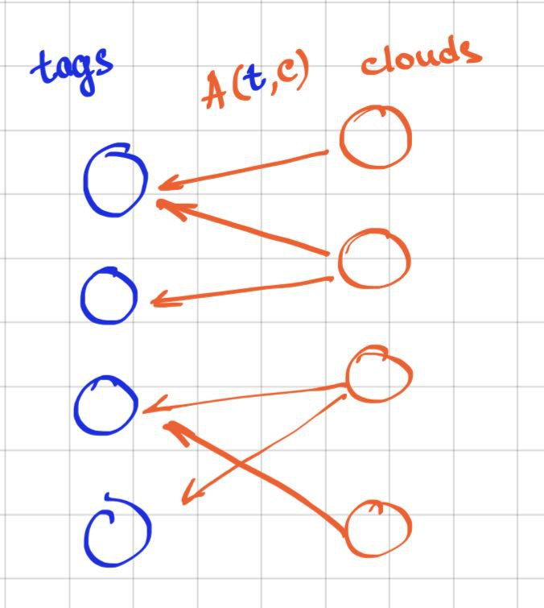

[SI AUGUSTUS CERNATUR, CERNANTUR QOUQUE AMICI]{style="float:right"}

##

`r format(Sys.Date(), "%d %b %Y")` 

`r library(knitr)`
`r library(markdown)`
`r library(best.friends)`
`r options(width=80,keep.source=TRUE)`
`r opts_chunk$set(echo=TRUE,message=FALSE,cache=FALSE,warning=FALSE)`
<!-- cache is off, we save all the necessary things in Rda -->

<div style="line-height: 1.5em;">

## Introduction

There is a simple intuition of what it means to be a friend. A friend of Augustus cares about Augustus more than about other people. And, if we see Augustus, then we infer to see friends(s) of Augustus also. Let’s translate it into statistical language.

Consider a set of genes and their loads in a set of expression patterns. Each pattern represents a biological process by the expression levels of the involved genes. 

Sometimes, the expression of a single gene indicates the activity of the entire pattern. In the simplest case, the gene has a nonzero load in only one pattern. 
Moreover, the gene may have several nonzero loads, but all of them but one are relatively small. Then the gene (AKA Augustus) is the marker gene for the pattern, and the marked pattern is the best friend of this gene. We want to identify the marker genes and corresponding patterns statistically.  

\paragraph{Model} The bipartite graph naturally fits this model. To generalise the example, we will refer to genes as \textit{{\tag}s}, to expression patterns, as \textit{{\collection}s}, and to any load as \textit{attention}. The sketch below illustrates the setting.

{width=50%}

To be more specific, we are given a set of collections $C = \{c_1, \dots, c_k\}$, and a set of tags $T = \{t_1, \dots, t_n\}$.
Each tag $t \in T$ and collection $c \in C$ are related by the attention $A(t, c)$, that the cloud pays to the tag. The strength of attention varies from $0$ to infinity, $A(t, c)\ge 0$. 

In the following, the attention values are stored in $n\times k$ matrix $\mathcal{A}$. 

The tag-collection-attention model applies to many problems in bioinformatics and statistics.

        Example                           tag $t$         collection $c$                           attention $A\left(t,c\right)$
--------------------------------------   -------------   ----------------------------------  ----------------------------
[gene regulation by TFs](#toyTF)          gene            genes under the TF regulation       strength of regulation
[transctironal correlations](#toynet)     gene            genes coexpressed with a gene       transcription correlation
fuzzy clustering                          object          cluster                             object weight in cluster
transcription decomposition               transcript      transcription pattern               transcript's load in pattern
weighted graph                            vertex          another vertex                      weight of edge between collection and tag
--------------------------------------   -------------   ----------------------------------  ----------------------------


\paragraph{Goal} For each tag, we want to identify the collection(s) that particularly prefer(s) the tag, if any. Then such a cloud is a friend (or the best friend if there is only one) for the tag. The simplest example: imagine that only one cloud pays attention to the tag in hand. We intend to express the meaning of the word "particularly" in this context by a statistical test.

The statistics we use to test whether the most friendly collection for the tag $t_i$ is really the best friend is the difference $t$ between the values $r(t_i,c_{(2)}(t_i))$ and $r(t_i,c_{(1)}(t_i))$, in other words, between the next-after-the-best and the best values $r$ for the tag $t_i$. We estimate the probability (p-value) to observe this difference as $<=t$ given the null-hypothesis proposition. If p-value is small enough, we reject the null, and claim that the friendliness of the cloud $c_{(1)}(t_i)$ is unlikely to observe by random and so we refer to it as the best friend of $t_i$. In this case, $t_i$ is a marker of its best friend cloud $c_{(1)}(t_i)$.

For each tag, the `best.friends.of` function returns the possible best friend and the corresponding uncorrected p-value for the observation provided the null model.

For a similar test that splits all the collections into $m$ friends of the tag and the remaining $|C|-k$ clouds uses the difference  $r(t_i,c_{(m+1)}(t_i))$ and $r(t_i,c_{(m)}(t_i))$. If we obtain the p-value that is small enough, we claim that the clouds $c_{(1)}(t_i)$..$c_{(m)}(t_i)$ are friends of $t_i$ and $t_i$ is their marker.

This option of the test is realised as the `best.friends` function.

Both functions have `neglect.diagonal` parameter; the boolean is to be set to `TRUE` for a specific case, when $k = n$ and the diagonal af the $A$ matrix is not supposed to carry any information, e.g. see the last examle in the table.

Please see our manuscript [] for more details.

## Code and examples in R

```{r source, echo=FALSE}
data.digits=2
p.val.digits=4
```
</div>

### Toy example

Let's start with something supersimple.

```{r}
relation<-matrix(ncol = 3,nrow=7)
rownames(relation)<-c("Tag1","Tag2","Tag3","Tag4","Tag5","Tag6","Tag7")
colnames(relation)<-c("Collection1","Collection2","Collection3")
relation[1,]<-c(0.2,0.1,0.3)
relation[2,]<-c(2,3,1)
relation[3,]<-c(0.1, 6 ,0.05 )
relation[4,]<-c(0.4, 1 ,3 )
relation[5,]<-c(0.25,0.15 ,0.3 )
relation[6,]<-c(2,0.9 ,0.4 )
relation[7,]<-c(.7,0.1 ,11 )
noquote(relation)
```
Let's run the best friends test.
```{r}
friends<-best.friends.test(relation)
noquote(format(friends,digits = p.val.digits))
```
Cloud 2 is the best friend of tag 3, and it is the only result with p-value less than 0.05. Makes sense. Tag 3 is the best for the collection 2, while it is the worst for other two collections.

### <a name="toyTF"></a> Toy regulation example

Let's return to the regulation example. We have ten TFs (TF1, TF2, ..) and ten genes (A,B,...) The strength of the regulation is shown by the matrix. The tags are genes, the collections are derived from their regulation by TFs.

```{r}
genes<-10
regulation=matrix(
    c(0.2, 0.2, 0.2, 0.2, 0.25, rep(0.2,genes-5),
      rep(1, genes),
        rep(1, genes),
        rep(1, genes),
        rep(1, genes),
        rep(1, genes),
        rep(1, genes),
        rep(1, genes),
        rep(1, genes),
        rep(1, genes)
    ),
    ncol=10,byrow=FALSE
)
gene.names<-LETTERS[seq( from = 1, to = genes )]
TF.names<-c('TF1','TF2','TF3','TF4','TF5','TF6','TF7','TF8','TF9','TF10')
rownames(regulation)<-gene.names
colnames(regulation)<-TF.names
```
So, we prepared the relation matrix.

```{r}
noquote(format(regulation,digits = data.digits))
```
Tags (genes) are rows, collections (TFs) are columns, it is consistent with $A\left(t,c\right)$ notation.

Searching for the best friend TF for each gene:

```{r}
friends<-best.friends.test(regulation)
noquote(format(friends,digits = p.val.digits))
```

Only gene E (the fifth) has a reliable best friend, and it is TF1. It is what we could see in the relation matrix, so what we calculate here is consistent with the intuition.

Let's search for the all possible friends for all genes.
```{r}
all.friends<-friends.test(regulation)
noquote(all.friends)
```

Again, only gene E (the fifth) has a reliable best friend, and it is TF1.
It is interesting to see that the tenth (worst) rank of all the genes is unexpectedly far away from 1 (the right column). It is an effect of ties, the worst ranks of all the genes but E but E are 5.5 and E is 6.

Add some randomness to the equal columns:
```{r}
set.seed(42)
regulation<-jitter(regulation)
noquote(format(regulation,digits = data.digits))
```

And, let's search for best friends again:

```{r}
friends<-best.friends.test(regulation)
noquote(format(friends,digits = p.val.digits))

```
And, for all friends:


```{r}
all.friends<-friends.test(regulation)
noquote(all.friends)
```

Almost all the effects disappear. There is some week signal for gene E is for {TF1,TF9,TF7,TF10} (uncorrected p-value=`r all.friends$pvals[5,4]`).


### <a name="toynet"></a> Toy net example


Let's represent the graph on the picture by its weighted adjacency matrix. The diagonal tags are NAs.

```{r}
connections<-matrix(nrow = 10,ncol=10,0)
names<-c('red','purple','blue','orange','green.1','green.2','green.3','green.4','green.5','green.6')
rownames(connections)<-names
colnames(connections)<-names
connections[,'red']<-5
connections['red',]<-5
connections['orange','red']<-0
connections['red','orange']<-0
connections['blue','orange']<-3
connections['orange','blue']<-3
connections['purple','blue']<-1
connections['blue','purple']<-1
diag(connections)=NA
noquote(format(connections,digits = data.digits))
```
Let's search for best friends (here, the diagonal is neglected by the construstion, and we let the test know it):

```{r}
friends<-best.friends.test(connections,neglect_diagonal = TRUE)
noquote(format(friends,digits = p.val.digits))

```
the blue is the best friend for the orange (uncorrected p-value=`r noquote(format(friends$p.value[4],digits = p.val.digits))`).

All friends test:

```{r}
all.friends<-friends.test(connections,neglect_diagonal = TRUE)
noquote(all.friends)
```
The same friendship: the blue is the best friend for the orange (uncorrected p-value=`r noquote(format(all.friends$pvals[4,1],digits = p.val.digits))`). All the nodes but the red are better friends for the the orange than the red is (uncorrected p-value=`r noquote(format(all.friends$pvals[4,8],digits = p.val.digits))`).  All the nodes but the orange are better friends for the the red than the orange is (uncorrected p-value=`r noquote(format(all.friends$pvals[1,8],digits = p.val.digits))`).

Session info to match stadadrds:
```{r}
sessionInfo()
```
