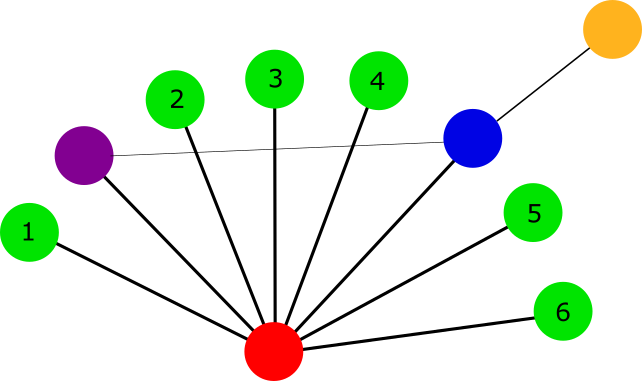

[SI AUGUSTUM VIDEAT AMICOS EIUS VIDEATI]{style="float:right"}

##

`r format(Sys.Date(), "%d %b %Y")` 

`r library(knitr)`
`r library(markdown)`
`r options(width=80,keep.source=TRUE)`
`r opts_chunk$set(echo=T,message=F,cache=F,warning=F)`
<!-- cache is off, we save all the necessary things in Rda -->

<div style="line-height: 1.5em;">

There is a simple intuition of what does it mean to be a friend. A friend of Augustus cares about Augustus more than about other persons. And, if one sees Augustus, it makes sense to infer to see friends(s) of Augustus also. Lets's try to translate it to staistical inferences.

Suppose we have set of elements $E$ and a set of communities $C$ of this elements with some fuzzy membership, e.g. there is a numeric measure of how an element is represented in a community $A\left(e,c\right)$ for each pair $(e,c): e \in E, c \in C$. The higher is $A\left(e,c\right)$ value is, the more element $e$ is involved in community $c$. The absence of the element in the community is shown by the value that is minimal for the commumity. 

A good [example](#toyTF) that is easy to think about is: genes are elements and their regulation by transcription factors (TF's) form communities, and $A$ shows the strength of the regulation. We look at a gene and we want to know whether a TF is its friend, i.e. whether the TF specifically regulates the gene. The na&iuml;ve idea is to look for a TF that the gene is the most sensitive for. Still, it's possible that this TF is the strongest for the most of the genes. Sometimes, it is what we want to find, but now we want to answer other questions, namely, what TF is the most specific factor for the gene and is the specificity enough to say that is does not look like a random outcome?

Sometimes, the communities are in in one-to-one relation with the elements, e.g. [each $c$ is a set of neighbours of $e$ in some graph](#toynet). For this example, $A$ is a weighted adjacency matrix of this graph. The friendship terminology emerges naturally from this case. The friendship relation itself is asymmetric: a friend cares about Augustus, while Augustus does not.

## Best friends

How does the friendship of a community to one of the elements looks like in terms of the $A$ values? The rank of the element in the friendly community is to be higher than in other communities and the difference is to be very unlikely to be obtained by chance.
https://www.frontiersin.org/articles/10.3389/fgene.2016.00024/full
For every community $\varsigma$ let's rank all the elements $e$ by the $A\left(e, \varsigma \right)$ value. The ranking is acsending, so rank 1 is for the maximal value. Let's map the ranks to  $\left[0,1\right]$ and let's denote the resulting values as $r\left(e,\varsigma \right)$. Then, for every element $\epsilon$ let's increasingly order all the communities by the $r \left( \epsilon , c \right)$ value. Let's denote the $i$-th community in the ordering for $\epsilon$ as $c_i\left(\epsilon \right)$. The ordered values are $r\left(\epsilon , c_i\left(\epsilon \right ) \right )$. 

Obviuosly, if the element $\epsilon$ has a best friend among the communities, the friend is $c_1\left(\epsilon \right)$. A friend of Augustus cares about Augustus more than about other persons. Let's note that $c_1\left(\epsilon \right)$ is defined for any element $\epsilon$, it is just $argmin_c \left( r \left( \epsilon, c \right) \right)$. To test whether $c_1\left(\epsilon \right)$ is the really the best friend of $\epsilon$, let's use the difference $t= r\left(\epsilon , c_2\left(\epsilon \right ) \right ) - r\left(\epsilon , c_1\left(\epsilon \right ) \right )$ between the best rank and the next as a test statitics. Generally, the larger is the difference, the less probable it is to get the value by chance. The "by chance" null model that all the relations are random numbers, and each community has its own distribution. If the null model holds, the ranks  $r\left( \epsilon, c \right)$ of the same element $\epsilon$ in different communities $c$  are distributed independently and identical. As far as they are normalised ranks, they are also uniformly distributed in $\left[0,1\right]$. U-statistics allows us to estimate the p-value for the value of $t$. The uncorrected p-value is $\left(1-t\right)^{\left|C\right|}$. If the p-value after the correction for multiple (actually, $\left| E \right|$) hypothesis, $c$ is a marker for $\varepsilon$. For each element, the `best.friends.of` function, returns the possible best friend, and the uncorrected p-value for the observation provided the null model. 

## Friends

The `best.friends.of` approach works great if the element $\epsilon$ has only one friendly community, all others are much more neutral about $\epsilon$. What happens if there are more than one friendly community, and the remainder is neutral for $\epsilon$. The difference between the best and the best-after-the-best is very small, and if fits the null hypothesis really well. But, if we go on looking at sequential differences  $t_j= r\left(\epsilon , c_{j+1}\left(\epsilon \right ) \right ) - r\left(\epsilon , c_j\left(\epsilon \right ) \right )$, one of them, that is the gap between friendly communities and neutral communities, can be unexpectedly high. For the worst rank of the element (it has number |C| in the ranking),  $t_{|C|}= 1. - r\left(\epsilon , c_{|C|}\left(\epsilon \right ) \right )$. The p-value for each of these $t$ values is the same, e.g.  $\left(1-t_j\right)^{\left|C\right|}$. The number of hypothesis to correct for is  $\left| E \right| \times \left| C \right| $.

## Code and examples in R

```{r source, echo=FALSE}
if (!suppressWarnings(require('best.friends')))
{
	if (!suppressWarnings(require('devtools')))
	{
		source("http://bioconductor.org/biocLite.R")
		biocLite("devtools")
		library("devtools")
	}
	install_github('favorov/best-friends/R@devel')
	library(best.friends)
}
data.digits=2
p.val.digits=4
```
</div>

### Toy example

Let's start with something supersimple.

```{r}
relation<-matrix(ncol = 3,nrow=7)
rownames(relation)<-c("Element1","Element2","Element3","Element4","Element5","Element6","Element7")
colnames(relation)<-c("Community1","Community2","Community3")
relation[1,]<-c(0.2,0.1,0.3)
relation[2,]<-c(2,3,1)
relation[3,]<-c(0.1, 6 ,0.05 )
relation[4,]<-c(0.4, 1 ,3 )
relation[5,]<-c(0.25,0.15 ,0.3 )
relation[6,]<-c(2,0.9 ,0.4 )
relation[7,]<-c(.7,0.1 ,11 )
noquote(relation)
```
Let's run the best friends test.
```{r}
friends<-best.friends.test(relation)
noquote(format(friends,digits = p.val.digits))
```
Community 2 is the best friend of element 3, and it is the only result with p-value less than 0.05. Makes sense. Element 3 is the best in the community 2, while it is the worst in other two communities.

### <a name="toyTF"></a> Toy regulation example

Let's return to the regulation example. We have ten TFs (TF1, TF2, ..) and ten genes (A,B,...) The strength of the regulation is shown by the matrix. The elements are genes, the communities are derived from their regulation by TFs.  

```{r}
genes<-10
gene.names<-LETTERS[seq( from = 1, to = genes )]
regulation=matrix(
	c(0.2, 0.2, 0.2, 0.2, 0.25, rep(0.2,genes-5),
	  rep(1, genes),
		rep(1, genes),
		rep(1, genes),
		rep(1, genes),
		rep(1, genes),
		rep(1, genes),
		rep(1, genes),
		rep(1, genes),
		rep(1, genes)
    ),
	ncol=10,byrow=FALSE
)
TF.names<-c('TF1','TF2','TF3','TF4','TF5','TF6','TF7','TF8','TF9','TF10')
rownames(regulation)<-gene.names
colnames(regulation)<-TF.names
```
So we prepared the relation matrix.

```{r}
noquote(format(regulation,digits = data.digits))
```
Elements (genes) are rows, communities (TFs) are columns, it is consistent with $A\left(e,c\right)$ notation. 

Searching for the best friend TF for each gene:

```{r}
friends<-best.friends.test(regulation)
noquote(format(friends,digits = p.val.digits))
```

Only gene E (the fifth) has a reliable best friend, and it is TF1. It is what we could see in the relation matrix, so what we calculate here is consistent with the intuition.

Let's search for the all possible friends for all genes.
```{r}
all.friends<-friends.test(regulation)
noquote(all.friends)
```

Again, only gene E (the fifth) has a reliable best friend, and it is TF1. 
It is interesting to see that the tenth (worst) rank of all the genes is unexpectedly far away from 1 (the right column). It is an effect of ties, the worst ranks of all the genes but E but E are 5.5 and E is 6.

Add some randomness to the equal columns:
```{r}
set.seed(42)
regulation<-jitter(regulation)
noquote(format(regulation,digits = data.digits))
```

And, let's search for best friends again:

```{r}
friends<-best.friends.test(regulation)
noquote(format(friends,digits = p.val.digits))

```
And, for all friends:


```{r}
all.friends<-friends.test(regulation)
noquote(all.friends)
```

Almost all effects disappears. There is some week signal for gene E is for {TF1,TF9,TF7,TF10} (uncorrected p-value=0.006).


### <a name="toynet"></a> Toy net example 



Let's write the graph on the picture by its weigthed adjacency matrix. The diagolnal elemant are NAs.

```{r}
connections<-matrix(nrow = 10,ncol=10,0)
names<-c('red','purple','blue','orange','green.1','green.2','green.3','green.4','green.5','green.6')
rownames(connections)<-names
colnames(connections)<-names
connections[,'red']<-5
connections['red',]<-5
connections['orange','red']<-0
connections['red','orange']<-0
connections['blue','orange']<-3
connections['orange','blue']<-3
connections['purple','blue']<-1
connections['blue','purple']<-1
diag(connections)=NA
noquote(format(connections,digits = data.digits))
```
Let's search for best friends:

```{r}
friends<-best.friends.test(connections)
noquote(format(friends,digits = p.val.digits))

```
blue is the best friend of orange (uncorrected p-value=0.013).

All friends test:

```{r}
all.friends<-friends.test(connections)
noquote(all.friends)
```
The same friendship: blue is the best friend of orande. And, also all the node but red are better friends for orange than red ((uncorrected p-value=0.03))

